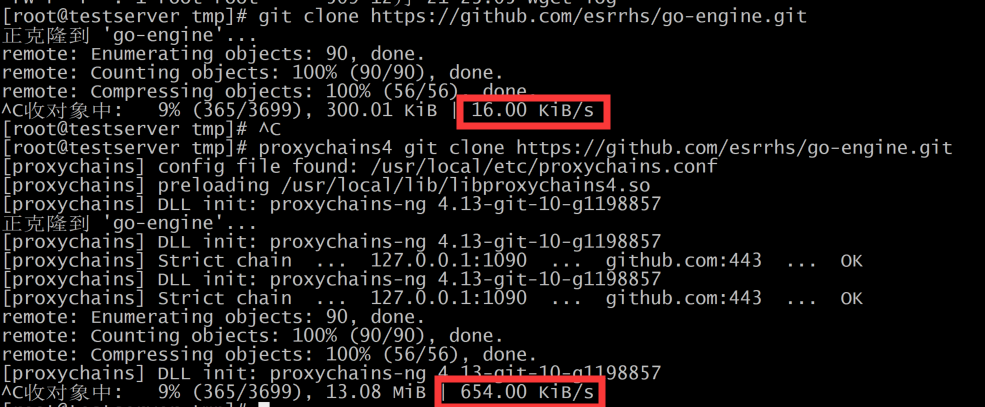

# Pingtunnel

[](https://github.com/esrrhs/pingtunnel)
[](https://github.com/esrrhs/pingtunnel)
[](https://goreportcard.com/report/github.com/esrrhs/pingtunnel)
[](https://github.com/esrrhs/pingtunnel/releases)
[](https://github.com/esrrhs/pingtunnel/releases)
[](https://hub.docker.com/repository/docker/esrrhs/pingtunnel)
[](https://github.com/esrrhs/pingtunnel/actions)

Pingtunnel is a tool that advertises tcp/udp/sock5 traffic as icmp traffic for forwarding. Used to break through the network blockade, or to bypass the WIFI network login verification, or speed up network transmission speed on some networks. 


# Why use this
* If the server's ip is blocked, all tcp udp packets are forbidden, but it can be pinged. At this point, you can continue to connect to the server with this tool.
* In the coffee shop or airport, you can connect to free wifi, but you need to log in to verify. At this time, you can use this tool to bypass the login, because wifi can not surf the Internet, but you can ping your server.
* In some networks, the transmission of tcp is very slow, but if the icmp protocol is used, the speed may be faster because of the operator's settings or the network topology. After testing, connecting the server of aws from mainland China has an accelerated effect.

# Sample
For example, the UDP traffic of the machine: 4545 is forwarded to www.yourserver.com:4455:
* Run with root privileges on the server at www.yourserver.com
```
sudo ./pingtunnel -type server
```
* Run with administrator privileges on your local computer
```
pingtunnel.exe -type client -l :4455 -s www.yourserver.com -t www.yourserver.com:4455
```
* If you see the client ping, pong log output, it means normal work
```
ping www.xx.com 2018-12-23 13:05:50.5724495 +0800 CST m=+3.023909301 8 0 1997 2
pong from xx.xx.xx.xx 210.8078ms
```
* If you want to forward tcp traffic, you only need to add the -tcp parameter to the client.
```
pingtunnel.exe -type client -l :4455 -s www.yourserver.com -t www.yourserver.com:4455 -tcp 1
```
* If you want to forward sock5 traffic, you only need to add the -sock5 parameter to the client.
```
pingtunnel.exe -type client -l :4455 -s www.yourserver.com -sock5 1
```
* Then you can start communicating with the local: 4455 port, the data is automatically forwarded to the remote, as you connect to www.yourserver.com:4455.

# Test
Test the acceleration effect of pingtunnel. The server is located in aws Korea and the client is located in mainland China.

download the centos image [centos jp mirror](http://ftp.riken.jp/Linux/centos/8/isos/x86_64/CentOS-8-x86_64-1905-dvd1.iso) , the results of direct wget, shadowsocks wget, and pingtunnel wget are as follows.

|              | wget     | shaowsocks | pingtunnel |
|--------------|----------|------------|------------|
| AlibabaCloud | 26.6KB/s | 31.8KB/s   | 897KB/s    |
| Home Broadband     | 23.1KB/s | 28.4KB/s   | 408KB/s    |

the acceleration effect is basically **20 times**.

Similarly, clone the github repository [go-engine](https://github.com/esrrhs/go-engine.git) , the acceleration effect is also obvious



# Download
cmd: https://github.com/esrrhs/pingtunnel/releases

QT GUI: https://github.com/esrrhs/pingtunnel-qt

# Docker
server:
```
docker run --name pingtunnel-server -d --privileged --network host --restart=always esrrhs/pingtunnel ./pingtunnel -type server -key 123456
```
client:
```
docker run --name pingtunnel-client -d --restart=always -p 1080:1080 esrrhs/pingtunnel ./pingtunnel -type client -l :1080 -s www.yourserver.com -sock5 1 -key 123456
```

# Stargazers over time

[](https://starchart.cc/esrrhs/pingtunnel)
      
# Usage
    By forging ping, the tcp/udp/sock5 traffic is forwarded to the destination server through the remote server. Used to break certain operators to block TCP/UDP traffic.

    Usage:

    // server
    pingtunnel -type server

    // client, Forward udp
    pingtunnel -type client -l LOCAL_IP:4455 -s SERVER_IP -t SERVER_IP:4455

    // client, Forward tcp
    pingtunnel -type client -l LOCAL_IP:4455 -s SERVER_IP -t SERVER_IP:4455 -tcp 1

    // client, Forward sock5, implicitly open tcp, so no target server is needed
    pingtunnel -type client -l LOCAL_IP:4455 -s SERVER_IP -sock5 1

    -type     client or server

    -l        Local address, traffic sent to this port will be forwarded to the server

    -s        The address of the server, the traffic will be forwarded to this server through the tunnel

    -t        Destination address forwarded by the remote server, traffic will be forwarded to this address

    -timeout  The time when the local record connection timed out, in seconds, 60 seconds by default

    -key      Set password, default 0

    -tcp      Set the switch to forward tcp, the default is 0

    -tcp_bs   Tcp send and receive buffer size, default 1MB

    -tcp_mw   The maximum window of tcp, the default is 10000

    -tcp_rst  Tcp timeout resend time, default 400ms

    -tcp_gz   Tcp will compress data when the packet exceeds this size, 0 means no compression, default 0

    -tcp_stat Print tcp connection statistic, default 0 is off

    -nolog    Do not write log files, only print standard output, default 0 is off

    -noprint  Do not print standard output, default 0 is off

    -loglevel log level, default is info

    -sock5    Turn on sock5 forwarding, default 0 is off

    -maxconn  the max num of connections, default 1000

    -maxprt   max process thread in server, default 100

    -maxprb   max process thread's buffer in server, default 1000

    -profile  Enable performance detection on the specified port. The default 0 is not enabled.

    -conntt   The timeout period for the server to initiate a connection to the destination address. The default is 1000ms.

    -s5filter Set the forwarding filter in the sock5 mode. The default is full forwarding. For example, setting the CN indicates that the Chinese address is not forwarded.

    -s5ftfile The data file in sock5 filter mode, the default reading of the current directory GeoLite2-Country.mmdb
